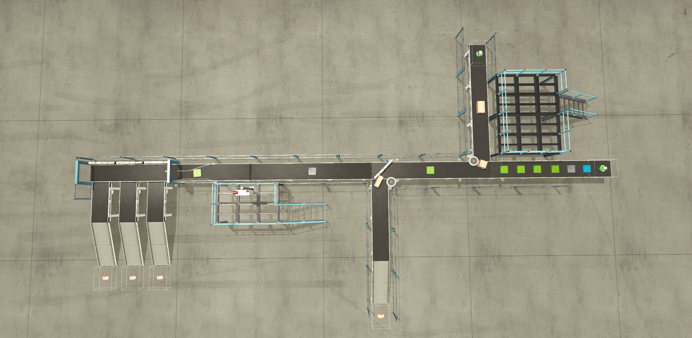
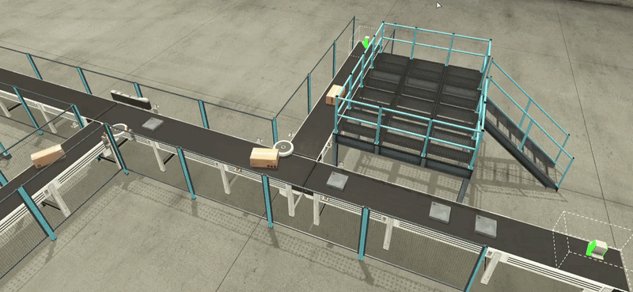
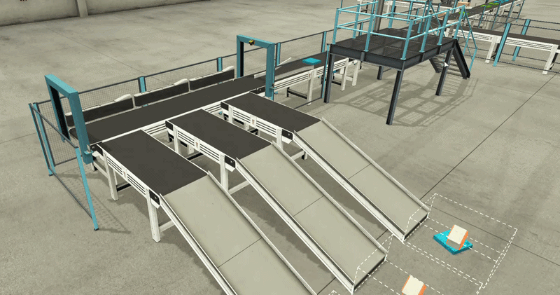
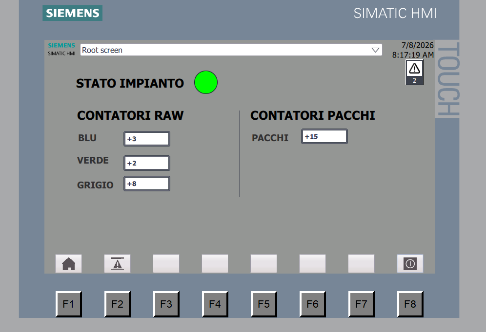
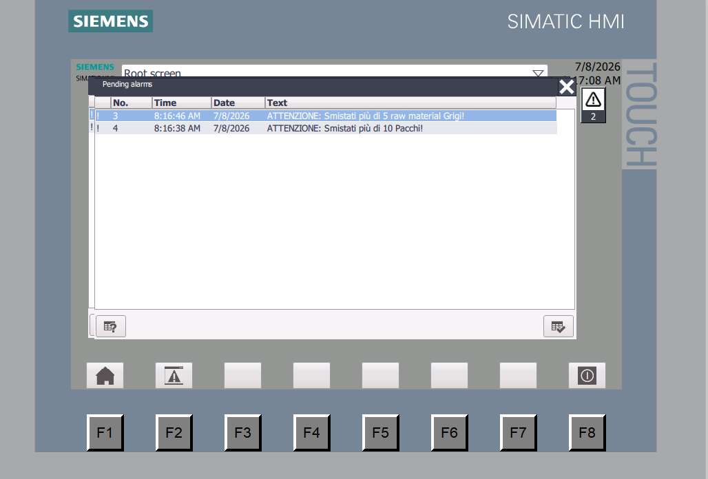

<div align="center">

# 🏭 Double Sorting System

### Automated Industrial Sorting Plant — PLC & SCADA

[](https://www.siemens.com)
[](https://factoryio.com)
[]()
[](https://www.unisa.it)

> A fully automated **dual-line sorting system** that manages two converging production flows — generic packages and color-coded raw materials — through a shared intersection, with intelligent vision-based sorting and real-time SCADA monitoring.

**Exam Project for TISC** *(Tecnologie Informatiche dei Sistemi di Controllo)*
*University of Salerno — A.Y. 2025/2026*

---



</div>

---

## 📑 Table of Contents

- [🔍 Project Overview](#-project-overview)
- [⚙️ How It Works](#️-how-it-works)
  - [The Intersection Problem](#the-intersection-problem)
  - [Vision-Based Color Sorting](#vision-based-color-sorting)
- [🏗️ System Architecture](#️-system-architecture)
- [🖥️ SCADA & HMI](#️-scada--hmi)
- [🛠️ Technologies Used](#️-technologies-used)
- [📂 Repository Structure](#-repository-structure)
- [🚀 Getting Started](#-getting-started)
- [👥 Team](#-team)

---

## 🔍 Project Overview

This project implements the complete automation of a **"Double Sorting System"** industrial plant, designed and simulated as part of the **TISC** (*Tecnologie Informatiche dei Sistemi di Controllo*) exam at the **University of Salerno**.

The plant handles two independent production lines that converge into a **critical shared intersection**:

| Line | Material | Sorting Logic |
|:-----|:---------|:-------------|
| 🟫 **Main Line** | Generic Packages | Diverted immediately after the intersection via IR sensor |
| 🔵🟢⚪ **Raw Line** | Color-coded Raw Materials (Blue, Green, Grey) | Identified by a **Vision Sensor** and routed to dedicated discharge bays |

The core challenge is to **arbitrate the intersection safely** (preventing collisions through mutual exclusion) while maintaining maximum throughput, and then **sort raw materials by color** using real-time image recognition — all governed by **Sequential Function Charts (SFC)** rigorously translated into **Ladder Logic**.

---

## ⚙️ How It Works

### The Intersection Problem

The most critical section of the plant is the **shared intersection** where two conveyor belts cross paths. Without proper control, packages from both lines would collide.

Our solution implements a **priority-based arbiter** (Intersection Manager) that acts as a traffic light — granting exclusive access to one line at a time, with asymmetric priority favoring the main package line.

<div align="center">



*The Intersection Manager arbitrating access between the two converging lines*

</div>

**Key features:**
- 🔒 **Mutual Exclusion** — Only one flow can occupy the intersection at any given time
- ⚡ **Priority System** — The main package line has precedence in case of simultaneous requests
- 🤝 **Handshake Protocol** — A formal request/grant/release cycle between conveyors and the arbiter prevents race conditions
- ⏱️ **Rising Edge Detection** — Transition timing uses `R_TRIG` on the exit sensor to ensure the *entire* package has cleared the intersection before releasing it

---

### Vision-Based Color Sorting

After passing through the intersection, raw materials travel under a **Vision Sensor** (camera) that identifies their color and triggers the appropriate diverter arm.

<div align="center">



*The Vision Sensor identifying colors and activating the corresponding diverter arms*

</div>

The sorting logic implements a **"Stop & Go"** mechanism:
1. 📷 The conveyor **stops** when a piece reaches the vision sensor
2. 🧠 The PLC reads the color code (`1` = Blue, `4` = Green, `7` = Grey)
3. 🔀 The corresponding diverter arm **opens** and its integrated belt activates
4. ✅ Once the piece clears the exit sensor, the system **resets** and the conveyor resumes

This ensures proper spacing between pieces and prevents sorting errors.

---

## 🏗️ System Architecture

The software architecture follows the **IEC 61131-3 structured programming paradigm**, decomposed into **4 independent, reusable Function Blocks (FB)**:

```
┌────────────────────────────────────────────────────────────────┐
│                      OB1 (Main Program)                        │
│                 Orchestrator & Safety Layer                    │
│                                                                │
│  ┌─────────────┐ ┌─────────────┐ ┌─────────────┐ ┌─────────┐   │
│  │  FB_Nastro  │ │ FB_Gestore  │ │ FB_Gestore  │ │   FB_   │   │
│  │  Ingresso   │ │  Incrocio   │ │ Smistamento │ │Deviatore│   │
│  │             │ │             │ │             │ │  (x4)   │   │
│  │  Conveyor   │ │ Intersect.  │ │   Sorting   │ │Diverter │   │
│  │  Control    │ │  Arbiter    │ │   Manager   │ │ Driver  │   │
│  └─────────────┘ └─────────────┘ └─────────────┘ └─────────┘   │
│                                                                │
│  ┌───────────────────────────────────────────────────────────┐ │
│  │          Safety Network — Emergency Stop Layer            │ │
│  └───────────────────────────────────────────────────────────┘ │
└────────────────────────────────────────────────────────────────┘
```

Each Function Block encapsulates an **SFC (Sequential Function Chart)** that was designed on paper and then mathematically translated into **Ladder Logic** using the 4-section method:
1. **Initialization** — Default state setup
2. **Transitions** — Guard conditions for state changes
3. **State Evolution** — Set/Reset of phase flags
4. **Actions** — Output assignments tied to active phases

---

## 🖥️ SCADA & HMI

The plant includes a fully configured **KTP900 HMI panel** for real-time supervision:

<div align="center">



*The SCADA interface showing real-time production counters and system status*

</div>

| Feature | Description |
|:--------|:-----------|
| 📊 **Production Counters** | Real-time count of sorted pieces per color and total packages |
| 🟢 **System Status** | Live indicator showing plant operational state |
| 🖥️ **Digital Displays** | Factory IO panel displays mirrored via `MOVE` instructions |

The HMI also features an **Analog Alarm** system — threshold-based alerts evaluated entirely by the HMI runtime, with zero CPU overhead on the PLC scan cycle:

<div align="center">



*Analog Alarms triggering when production counters exceed critical thresholds*

</div>

---

## 🛠️ Technologies Used

<div align="center">

| Technology | Purpose |
|:----------:|:--------|
| ⚙️ | **TIA Portal V17** — PLC programming (Ladder) & HMI design |
| 🏭 | **Factory IO** — 3D industrial plant simulation |
| 📐 | **IEC 61131-3 / SFC** — Formal specification & state machine design |
| 🎨 | **Draw.io** — SFC diagram design & documentation |

</div>

**PLC Model:** SIMATIC S7-1200 (simulated via PLCSIM)
**HMI Panel:** KTP900 Basic PN
**Communication:** PROFINET (native Siemens S7 driver)

---

## 📂 Repository Structure

```
📦 Double-Sorting-System/
├── 📁 TIA_Portal_Project/       # Complete TIA Portal project (PLC + HMI)
├── 📁 FactoryIO_Scene/          # Factory IO scene file
├── 📁 docs/                     # Project documentation & SFC diagrams
├── 📁 Media/                    # Images and GIFs
├── 📄 README.md
├── 📄 LICENSE
└── 📄 .gitignore
```

---

## 🚀 Getting Started

### Prerequisites
- **TIA Portal V17** (or later) with PLCSIM
- **Factory IO** (licensed or trial)
- **Siemens S7-PLCSIM** for PLC simulation

### Setup
1. Clone this repository
   ```bash
   git clone https://github.com/YOUR_USERNAME/Double-Sorting-System.git
   ```
2. Open the TIA Portal project from `TIA_Portal_Project/`
3. Open the Factory IO scene from `FactoryIO_Scene/`
4. In TIA Portal: **Compile** → **Download to PLCSIM** → **Start simulation**
5. In Factory IO: **Connect** → Press **Play** ▶️
6. Watch the magic happen! 🎉

---

# 🐺 Team Members

- ◽ [Christian Salvatore Bove](https://github.com/bove903)
- ◽ [Andrea Botta](https://github.com/AndreaBotta333)
